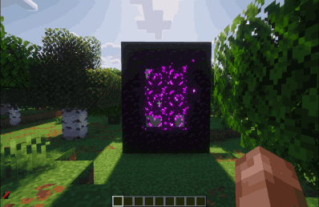
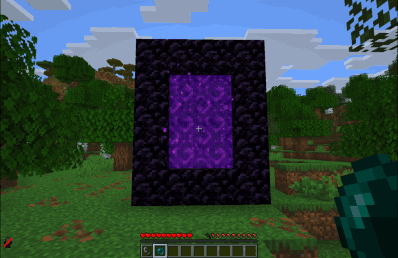
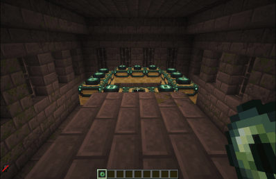
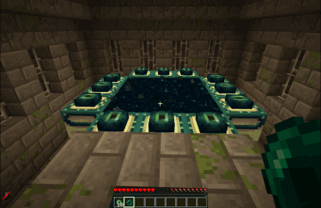

# Disable Dimensions

[](https://modrinth.com/datapack/disable-dimensions)
[](https://modrinth.com/datapack/disable-dimensions)
[](https://modrinth.com/datapack/disable-dimensions)

A **hard-to-break, grief-resistant solution** for preventing players from entering **The Nether** and/or **The End**.

Allows you to disable dimensions by removing any possible way for players to enter them. Each dimension can be separately `enabled` or `disabled`.

> Perfect for vanilla and modded multiplayer servers where you want to disable further dimensions to prevent players from progressing too fast.

## Configuration

You can configure it using the config panel:

```mc
/function disable_dimensions:config
```

## Showcase

> Already lit Nether Portal
>
> 

> Igniting Nether Portal
>
> 

> Throwing Ender Pearl at Nether Portal
>
> 

> Activating End Portal (Outside)
>
> 

> Activating End Portal (Inside)
>
> 

> Throwing Ender Pearl at End Portal
>
> 

## Performance Notice

Be aware that this data pack/mod performs two small 7x7x7 block scans per player and per ender pearl entity per tick when dimensions are disabled (a total of **686 blocks per player and per ender pearl per tick**, or **343** if only one, The Nether or The End, is disabled).

Through testing in vanilla with `f3 + 2`, the average cost was measured at around **0.034 ms per entity per tick**. Even with **800 pearls**, the server’s median tick time increased only by about **27 ms**, which equals roughly **+6.75 ms/tick at 200 players** and **<1 ms/tick below 30 players**.

This is extremely lightweight under normal server loads and will not noticeably affect performance. If your server hosts hundreds of players simultaneously, you might need to use a different solution. But as far as I’m aware, any data pack based solution that’s as safe as mine requires this kind of scanning to work!

> Testing was done on a MacBook Pro 14" (M1 Pro).

## Contributing & Issues

I warmly welcome:

- Bug reports
- Feature requests
- Pull requests

Please open issues or PRs on [GitHub](https://github.com/nwrenger/disable-dimensions/issues).

## License

This project is licensed under the **MIT License**. See [LICENSE](https://github.com/nwrenger/disable-dimensions/blob/main/LICENSE) for details.
