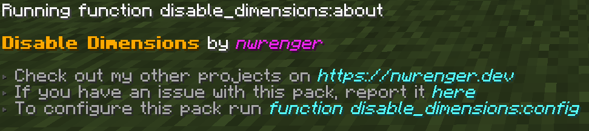
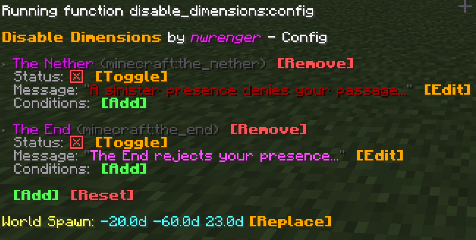
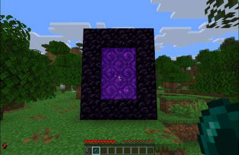
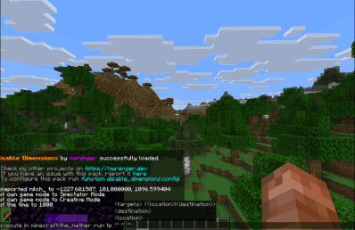
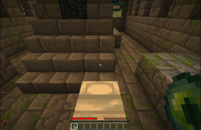
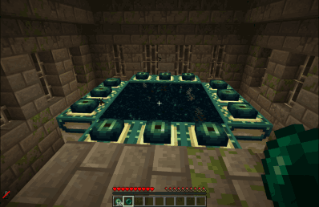
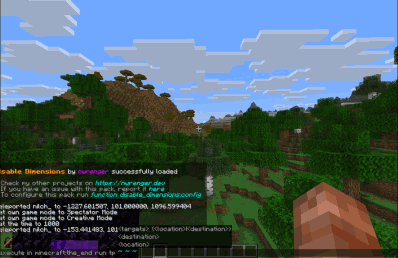

# Disable Dimensions

[](https://modrinth.com/datapack/disable-dimensions)
[](https://modrinth.com/datapack/disable-dimensions)
[](https://modrinth.com/datapack/disable-dimensions)

A **hard-to-break, grief-resistant solution** for preventing players from entering **The Nether**, **The End**, and any further **custom dimensions**, with optional per-dimension **conditions**.

Allows you to disable dimensions by intercepting all known dimension-entry methods and returning players immediately. Each dimension can be separately `enabled` or `disabled`, with optional conditions which override that status.

> Perfect for vanilla and modded multiplayer servers where you want to disable further dimensions to prevent players from progressing too fast.

## Why use this data pack/mod?

1. **Only Complete Solution**:
   No other data pack currently disables The Nether, The End, and further custom dimensions, with optional per-dimension conditions, for the current Minecraft versions.
   All older ones are outdated, broken, or not as feature rich.
2. **Comprehensive Coverage**:
   Works in every situation. For players in all game modes, teleportation commands, ender pearls, minecarts, and more.
   Players can enter portals or teleport, but are instantly teleported back. From the Nether to their entry point with a fallback to world spawn, and from the End to their respawn point or world spawn. See [Edge Cases](#edge-cases) for the handful of scenarios that require manual cleanup.
3. **Intended Vanilla Reward**:
   Players who try to swap dimensions will still receive the vanilla “entered dimension” advancement (for the Nether or the End).
   This is intentional and serves as a small reward for their attempt. And you know who tried by checking their achievements. Don’t worry, they’ll get teleported back safely!
4. **Immersive Feedback**:
   On teleport back, players see a short action bar message, hear a subtle sound cue and get a slowness effect applied, making the experience clear and responsive without being intrusive.
5. **Flexible and Compatible**:
   Works as either a global mod or a world-specific data pack, includes built-in language support, and is fully compatible with vanilla, modded, and custom dimensions setups right out of the box.
6. **Server-Ready**:
   Built to be reliable, grief-resistant, and completely passive, with no extra overhead through tick-based checks. Perfect for public or semi-public multiplayer servers.
7. **Dynamic Configuration**:
   Can be adjusted in real time through the in-game config panel, no reloads or restarts required.

> **TL;DR**: A stable and lightweight way to stop unwanted dimension travel, made to just work.

## Installation

After adding the data pack/mod to your world or server, you should be able to open the about panel, which is fully controllable with the mouse:

```mcfunction
/function disable_dimensions:about
```



### Language Support

Translated text is available for supported languages. This is mainly intended for server admins, since the configurable messages shown to players can be customized anyway.

- **Mod in Single Player**: Included automatically and works out of the box.
- **Data Pack or Server Setup**: Translations are client-side. For a dedicated server that only uses the data pack, the admin needs either the mod on their client or the separate [resource pack]() to see translated UI text.

To add new translations, please refer to [this README](https://github.com/nwrenger/disable-dimensions/tree/main/resourcepack#readme).

## Configuration

Open the configuration panel by the following command:

```mcfunction
/function disable_dimensions:config
```



From here, you can:

- Toggle each dimension `enabled` / `disabled`
- Edit the return message and color
- Add and remove conditions, see [Conditions](#conditions) for further information
- Add custom dimension entries, see [Custom Dimensions](#custom-dimensions) for a guide
- Remove dimension entries
- Reset dimension entries to defaults
- Set the World Spawn

> A default World Spawn exists, but you **should** set it to your desired location once before production use by standing there and pressing `Replace`.

### Conditions

Conditions can overwrite the current set status if they're true. With them you can partially enable/disable dimension travel after a specific time, for a specific gamemode and so on.

Each condition requires:

- `name`: A unique name for the condition.
- `type`: Determines what the value gets checked against.
  - `gamemode`: Against the current gamemode. The value can be `survival`, `creative`, `adventure`, `spectator`.
  - `gametime`: Against the time the game was run. This is given in ticks, so make sure to apply a formula like this for days `day_count * 24 * 60 * 60 * 20`. This time only advances while the world is running, so server downtime will affect accuracy.
  - `item`: Against the items inside the player's inventory. It can be checked after the item id with an optional filter by item components, for example `minecraft:diamonds[count=64]`.
  - `tag`: Against the tags of the player. You can give players custom tags, like `enter_all`, and set the value to that tag to enable/disable their entry.
- `value`: The specific value which gets checked against. Is different based on the set type.
- `disabled`: The disabled value which overwrites the current status if the condition applies.

> If you have multiple conditions, only one of them needs to be true to overwrite the current status.

> It's not adviced to have multiple conditions which can cancel each other out, like both applying for the current player but one enabling and the other one disabling travel. This will result in unexpectable behavior.

Here are three examples of conditions for `minecraft:the_nether`:

1. **Enable after one day**

```mcfunction
/function disable_dimensions:config/dimension/condition/add {id:"minecraft:the_nether",name:"1d Enable",type:"gametime",value:"1728000", disabled:"false"}
```

2. **Enable for creative mode**

```mcfunction
/function disable_dimensions:config/dimension/condition/add {id:"minecraft:the_nether",name:"Allow Creative",type:"gamemode",value:"creative", disabled:"false"}
```

3. **Disable after 7 days**

```mcfunction
/function disable_dimensions:config/dimension/condition/add {id:"minecraft:the_nether",name:"7d Disable",type:"gametime",value:"12096000", disabled:"true"}
```

### Custom Dimensions

To block a custom dimension, add a new entry via the config panel.

Each entry requires:

- `name`: The display name of the entry. Used for display in the config panel and shouldn't be empty.
- `id`: The in-game dimension identifier, needs to match the one of the custom dimension.
- `type`: Determines how and where the player will be sent back.
  - `nether_entered_pos`: Sends the player to their last Nether entry position. Only valid for The Nether.
  - `respawn`: Sends the player to their respawn point, or to the World Spawn if none is set. Used for The End and other custom dimensions.
- `message_color`: The color of the message shown to the player on return, use valid text component colors.
- `message_text`: The text of the message shown to the player on return.

Here are two examples of adding a custom dimension:

1. **The Aether**

```mcfunction
/function disable_dimensions:config/dimension/add {name: "The Aether", id: "aether:the_aether", type: "respawn", message_color: "aqua", message_text:"A radiant force from the heavens bars your ascent..."}
```

2. **ATM10 - The Other**

```mcfunction
/function disable_dimensions:config/dimension/add {name: "The Other", id: "allthemodium:the_other", type: "respawn", message_color: "dark_purple", message_text:"A mysterious force from The Other prevents your entry..."}
```

### Server Only

The config panel will only be usable when you're physically logged in to the server and have `op`.

To configure the data pack/mod, you can use the config commands used by the config panel directly inside the server terminal as follows:

- Dimensions
  - Add Entry: `function disable_dimensions:config/dimension/add {name: "", id: "", type: "", message_color: "", message_text:""}`
  - Enable: `function disable_dimensions:config/dimension/enable {id: ""}`
  - Disable: `function disable_dimensions:config/dimension/disable {id: ""}`
  - Edit Message: `function disable_dimensions:config/dimension/message {id: "", message_color: "", message_text:""}`
  - Remove Entry: `function disable_dimensions:config/dimension/remove {id: ""}`
  - Reset Entries: `function disable_dimensions:config/dimension/reset`
- Conditions
  - Add: `function disable_dimensions:config/dimension/condition/add {id:"",name:"",type:"",value:"", disabled:"false"}`
  - Enable: `function disable_dimensions:config/dimension/condition/enable {id:"", name:""}`
  - Disable: `function disable_dimensions:config/dimension/condition/disable {id:"", name:""}`
  - Edit: `function disable_dimensions:config/dimension/condition/edit {id:"", name:"", type:"", value:""}"`
  - Remove: `function disable_dimensions:config/dimension/condition/remove {id:"", name:""}`
- World Spawn:
  - Set: _Not possible_ due to requiring physical presence at the desired location

> The `id` will be the dimension identifier from the game.
> For The Nether it's `{id: "minecraft:the_nether"}` and for The End it's `{id: "minecraft:the_end"}`.

## Edge Cases

This data pack/mod is intentionally event-driven, with a few rare transitions requiring manual cleanup or resulting in different from expected behavior:

1. **Respawn in disabled dimension**:
   If a respawn point via a respawn anchor or the `spawnpoint` command is set inside a dimension that later gets disabled, the player will continue to respawn there until the respawn point is cleared or reset.
2. **Already inside on disable**:
   Players who are already in The Nether, The End, or a custom dimension when it gets disabled will remain there until they change dimensions. Teleport them out if needed.
3. **Custom dimension respawn limitations**:
   Custom dimensions like The Aether can add new respawn mechanics, but these are rejected since they rely on custom dimensions or blocks.

## Showcase

> **'Going Through' Nether Portal**
>
> 

> **Throwing Ender Pearl at Nether Portal**
>
> 

> **Teleporting to The Nether**
>
> 

> **'Going Through' End Portal**
>
> 

> **Throwing Ender Pearl at End Portal**
>
> 

> **Teleporting to The End**
>
> 

## Contributing & Issues

I warmly welcome:

- Bug reports
- Feature requests
- Pull requests

Please open issues or PRs on [GitHub](https://github.com/nwrenger/disable-dimensions/issues).

## License

This project is licensed under the **GPLv3 License**. See [LICENSE](https://github.com/nwrenger/disable-dimensions/blob/main/LICENSE) for details.
