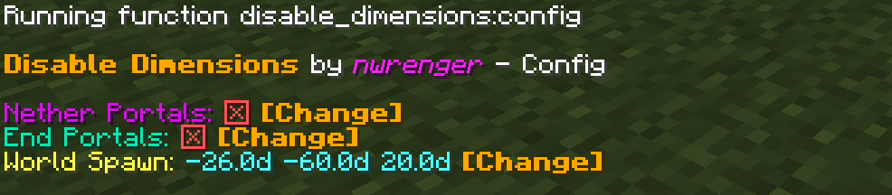
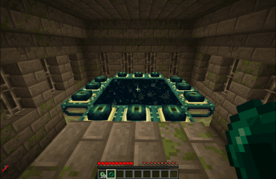

# Disable Dimensions

[](https://modrinth.com/datapack/disable-dimensions)
[](https://modrinth.com/datapack/disable-dimensions)
[](https://modrinth.com/datapack/disable-dimensions)

A **hard-to-break, grief-resistant solution** for preventing players from entering **The Nether** and/or **The End**.

Allows you to disable dimensions by removing any possible way for players to enter them. Each dimension can be separately `enabled` or `disabled`.

> Perfect for vanilla and modded multiplayer servers where you want to disable further dimensions to prevent players from progressing too fast.

## Why use this data pack/mod?

1. **Only Complete Solution**:
   No other data pack currently disables both the Nether and the End for the current Minecraft versions.
   All older ones are outdated or broken.
2. **Comprehensive Coverage**:
   Works in every situation. For players in all game modes, teleportation commands, ender pearls, minecarts, and more.
   Players can enter portals/teleport, but are instantly teleported back. From the Nether to their entry point with a fallback to world spawn, and from the End to their respawn point or world spawn.
3. **Intended Vanilla Reward**:
   Players who try to swap dimensions will still receive the vanilla “entered dimension” advancement (for the Nether or the End).
   This is intentional and serves as a small reward for their attempt. And you know who tried by checking their achievements. Don’t worry, they’ll get teleported back safely!
4. **Immersive Feedback**:
   On teleport back, players see a short action bar message, hear a subtle sound cue and get a slowness effect applied, making the experience clear and responsive without being intrusive.
5. **Flexible and Compatible**:
   Works as either a global mod or a world-specific data pack, fully compatible with both vanilla and modded setups right out of the box.
6. **Server-Ready**:
   Built to be reliable, grief-resistant, and completely passive, with no extra overhead through tick-based checks. Perfect for public or semi-public multiplayer servers.
7. **Dynamic Configuration**:
   Can be adjusted in real time through the in-game config panel, no reloads or restarts required.

> **TL;DR**: A stable and lightweight way to stop unwanted dimension travel, made to just work.

## Installation

After adding the data pack/mod to your world or server, you should be able to open the about panel, which is fully controllable with the mouse:

```mcfunction
/function disable_dimensions:about
```


## Configuration

You can configure everything through the config panel, which also fully controllable with the mouse. You **may** toggle the **status** for each dimension and edit the **messages** shown to players on return; just be sure to use valid minecraft text component colors. Furthermore, you **must** also set the **World Spawn** at least once from this panel. Make sure you’re standing at the desired spawn location when doing so:

```mcfunction
/function disable_dimensions:config
```



### Server Only

The config panel will only be usable when you're physically logged in to the server and have `op`.

To configure the data pack/mod, you can use the config toggles which get called by the config panel directly inside the server terminal as follows:

- The Nether:
  - Enable: `function disable_dimensions:config/nether/enable`
  - Disable: `function disable_dimensions:config/nether/disable`
  - Edit Message: `function disable_dimensions:config/nether/message {color:"",text:""}`
- The End:
  - Enable: `function disable_dimensions:config/end/enable`
  - Disable: `function disable_dimensions:config/end/disable`
  - Edit Message: `function disable_dimensions:config/end/message {color:"",text:""}`
- World Spawn:
  - Set: _Not possible_ due to requiring physical presence at the desired location

## Showcase

> **'Going Through' Nether Portal**
>
> 

> **Throwing Ender Pearl at Nether Portal**
>
> 

> **Teleporting to The Nether**
>
> 

> **'Going Through' End Portal**
>
> 

> **Throwing Ender Pearl at End Portal**
>
> 

> **Teleporting to The End**
>
> 

## Contributing & Issues

I warmly welcome:

- Bug reports
- Feature requests
- Pull requests

Please open issues or PRs on [GitHub](https://github.com/nwrenger/disable-dimensions/issues).

## License

This project is licensed under the **MIT License**. See [LICENSE](https://github.com/nwrenger/disable-dimensions/blob/main/LICENSE) for details.
